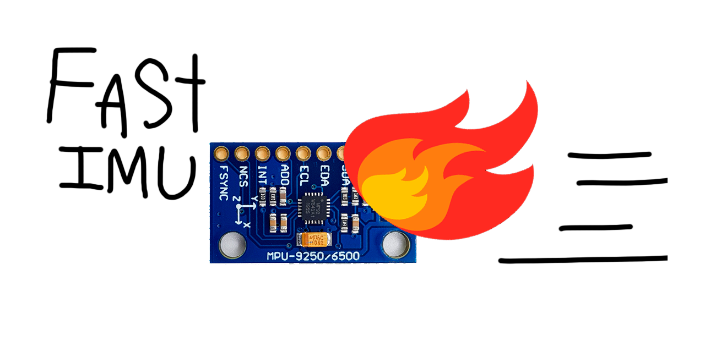
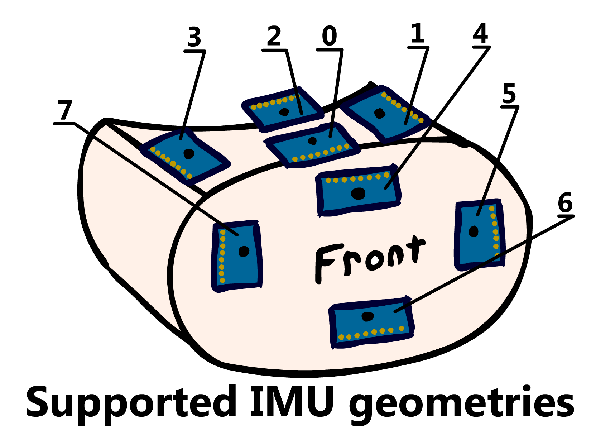

# FastIMU


### Supported IMUS: 

* MPU9255 
* MPU9250 
* MPU6886 
* MPU6515 
* MPU6500 
* MPU6050
* ICM20689 
* ICM20690
* ICM20948 
* BMI055 
* BMX055 (Magnetometer currently untested)
* BMI160
* LSM6DS3 (And some of it's variants)
* LSM6DSL (currently untested)
* QMI8658

### Supported Magnetometers:
* QMC5883L
* HMC5883L
* AK8975
* AK8963
* AK09918
* BMM150

### Using non default I2C ports:
If you're planning on using an IMU on a non-default I2C port, you can specify the port in the constructor of your IMU, for example:
```c++
ICM20689 IMU1(Wire); 
MPU6500 IMU2(Wire1); 
```
creates two IMU objects, `ICM20689` will be using the I2C port assigned to `Wire` and `MPU6500` will be on the I2C port assigned to `Wire1`.

### Hybrid IMU's:
You can also use Hybrid IMU's, which means you can add any supported magnetometer to any supported IMU by using the `IMU_HYBRID` class as follows:
```c++
IMU_HYBRID<IMU, MAG> IMU(Wire);
```

For example
```c++
IMU_HYBRID<MPU6050, QMC5883L> IMU(Wire);
```

creates a hybrid `MPU6050` and `QMC5883L` IMU object that behaves as a single IMU, that returns accel and gyro values from the `MPU6050` and magnetometer values from the `QMC5883L` respectively

### Planned:
* BNO080 (probably soonish)
* GY-85
* BNO055 (the one I bought is DOA... might take a bit)
* BMI270 (if I can get my hands on one)

### Data types

* ```AccelData``` Contains all three axis of Accelerometer data, these are named ```accelX```, ```accelY``` and ```accelZ```. Also contains a ```timestamp``` field (uint32_t, microseconds from ```micros()```) updated only when the sensor has new data.

* ```GyroData``` Contains all three axis of Gyroscope data, these are named ```gyroX```, ```gyroY``` and ```gyroZ```. Also contains a ```timestamp``` field updated independently of ```AccelData```.

* ```MagData``` Contains all three axis of Magnetometer data, these are named ```magX```, ```magY``` and ```magZ```. Also contains a ```timestamp``` field updated only when the magnetometer has new data.

* ```Quaternion``` Contains Quaternion data, the components are named ```qW```, ```qX```, ```qY``` and ```qZ```. Also contains a ```timestamp``` field.

* ```CalData``` Contains a boolean component named ```valid``` that must be set to ```true``` if the data is valid, it contains float array named ```accelBias``` for accelerometer biases, one named ```gyroBias``` for gyroscope bias, one named ```magBias``` for magnetometer biases and one named ```magScale``` for magnetometer scaling.

### Functions
* ```init``` Takes in a ```calData``` function and an optional ```byte``` address, this function initializes the IMU, it defaults to the maximum ranges allowed by the IMU. This function will return a 0 if initialization was successful and a negative number if it failed to connect to the IMU. if no address is provided, the default for the selected IMU will be used.

* ```update``` Reads new IMU data if available.

* ```getAccel``` Takes in a pointer to ```AccelData``` and copies new accelerometer data to it, should be called after update.

* ```getGyro``` Takes in a pointer to ```GyroData``` and copies new gyroscope data to it, should be called after update.

* ```getMag``` Takes in a pointer to ```MagData``` and copies new magnetometer data to it, should be called after update. Will only return new magnetometer data if the IMU has a magnetometer.
 
* ```getQuat``` Takes in a pointer to a ```Quaternion``` and copies new quaternion data to it, should be called after update. Will only return new Quaternion data if the IMU has a Quaternion output.

* ```getTemp``` Returns temperature float data in °C, should be called after update, isn't very accurate.

* ```setGyroRange``` Takes in an integer with the dps range wanted, (for example 2000 for ±2000dps), returns 0 if successful, returns -1 if the input range is not valid.

* ```setAccelRange``` Takes in an integer with the dps range wanted, (for example 8 for ±8g), returns 0 if successful, returns -1 if the input range is not valid.

* ```setIMUGeometry``` Takes in an integer with the wanted geometry index, rotates IMU measurements to match vr headset IMU mount. (see chart below).

* ```setAccelODR``` Takes in an integer target output data rate in Hz and sets the accelerometer ODR to the nearest supported rate greater than or equal to the requested value. Returns the actual ODR that was set, or -1 if the sensor does not support configurable ODR.

* ```setGyroODR``` Same as ```setAccelODR``` but for the gyroscope. On some sensors (e.g. MPU6050-family) accel and gyro share a rate divider so setting one affects both.

* ```setMagODR``` Same as ```setAccelODR``` but for the magnetometer. Returns -1 if the IMU has no magnetometer or if it does not support a configurable continuous ODR (e.g. AK8975).

* ```getAccelODR``` Returns the current accelerometer ODR in Hz as last set by ```setAccelODR```, or -1 if not supported.

* ```getGyroODR``` Returns the current gyroscope ODR in Hz as last set by ```setGyroODR```, or -1 if not supported.

* ```getMagODR``` Returns the current magnetometer ODR in Hz as last set by ```setMagODR```, or -1 if not supported.

* ```calibrateAccelGyro``` Takes in a pointer to calibration data and runs a Accelerometer and Gyroscope calibration, storing the new accelerometer and gyroscope calibration data in it. the IMU should be kept completely still and level during this.

* ```calibrateMag``` Takes in a pointer to Calibration data and runs a Accelerometer and Gyroscope calibration, storing the new accelerometer and gyroscope calibration data in it. the IMU should be moved in a figure eight pattern while calibrating, calibration takes around 15 seconds.

* ```hasMagnetometer``` Returns true if the IMU has a magnetometer.

* ```hasTemperature``` Returns true if the IMU has a thermometer.

* ```hasQuatOutput``` Returns true if the IMU has a direct quaternion output.

* ```IMUName``` Returns a string containing the IMU's name.

* ```IMUType``` Returns a string containing the IMU's type.

* ```IMUManufacturer``` Returns a string containing the IMU's manufacturer.


### Supported IMU VR geometries (and their index numbers):



##### TODO: VQF? built in filters?
##### TODO: get DMP working for pure quaternion output from invsense IMU's
##### TODO: get FIFO working for all IMU's that have it.
##### TODO: get proper matrix magnetometer calibration working instead of the current scalar garbage.